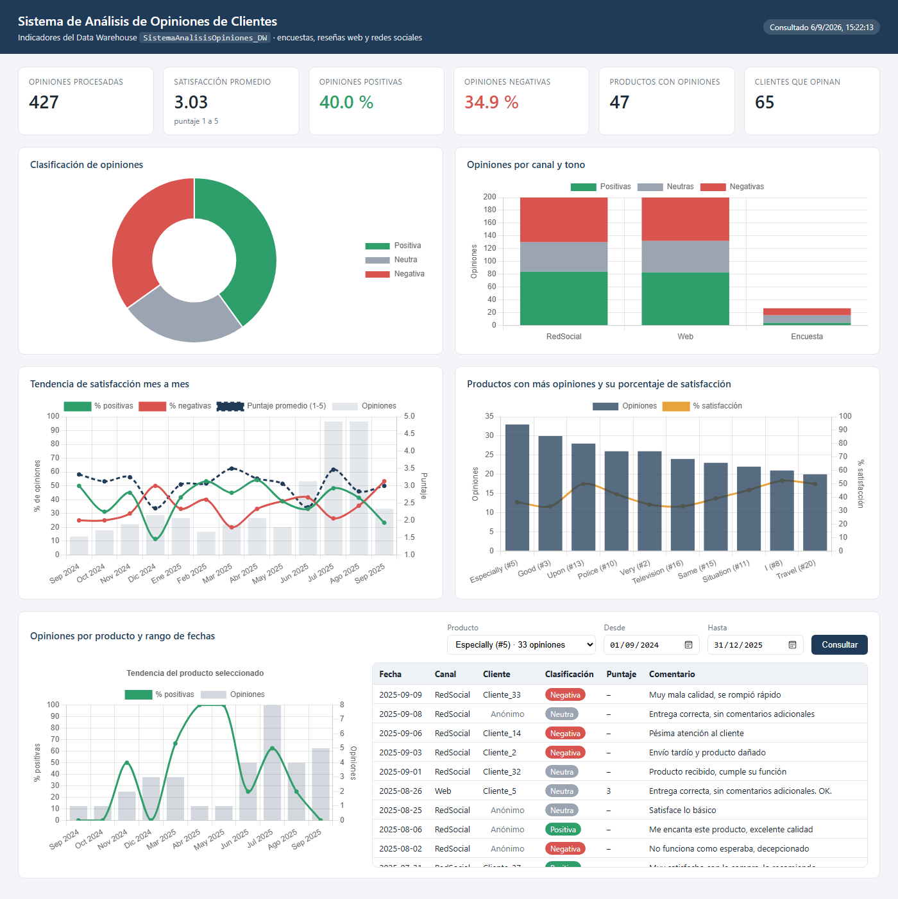
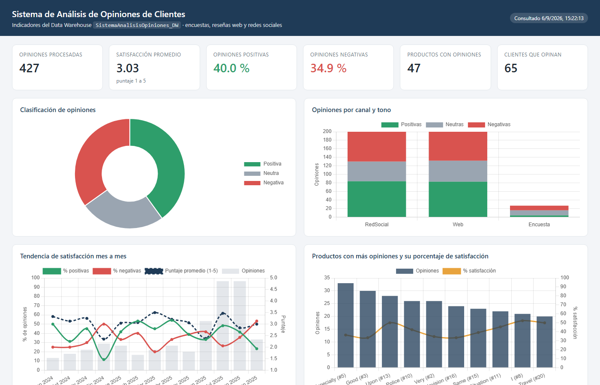
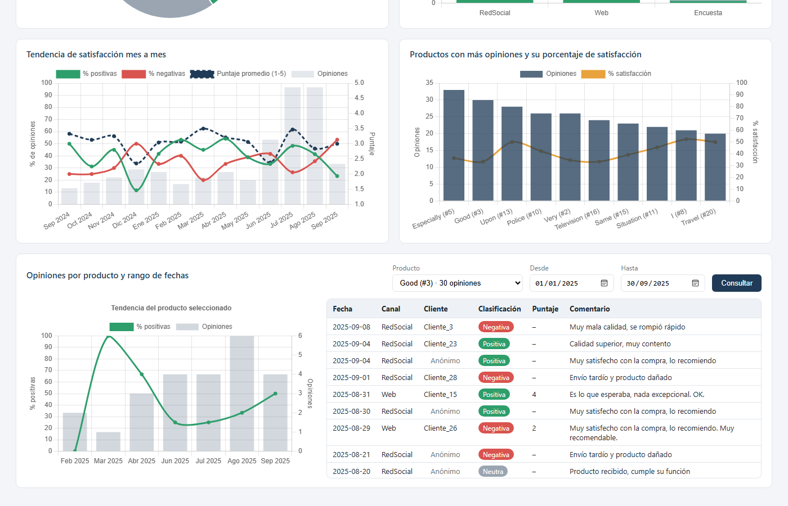
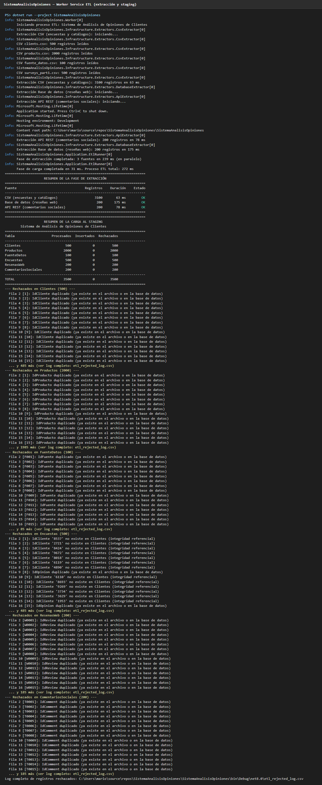
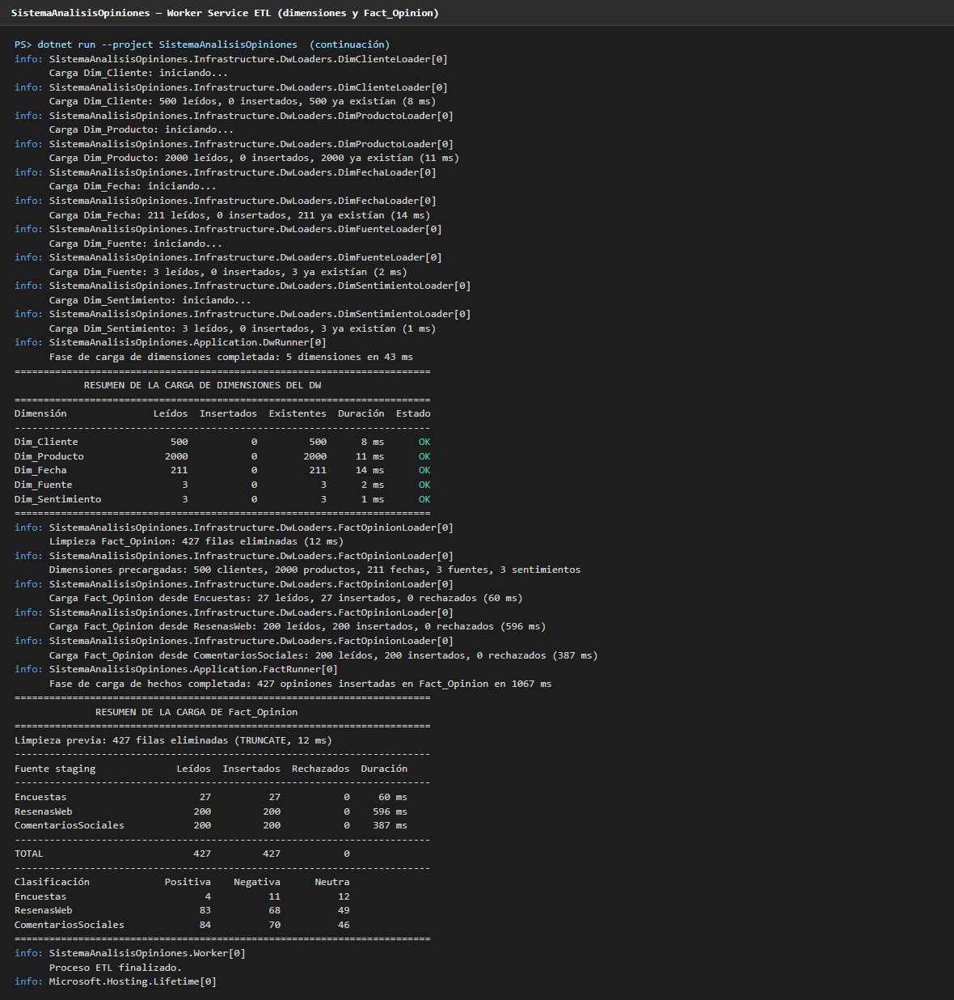
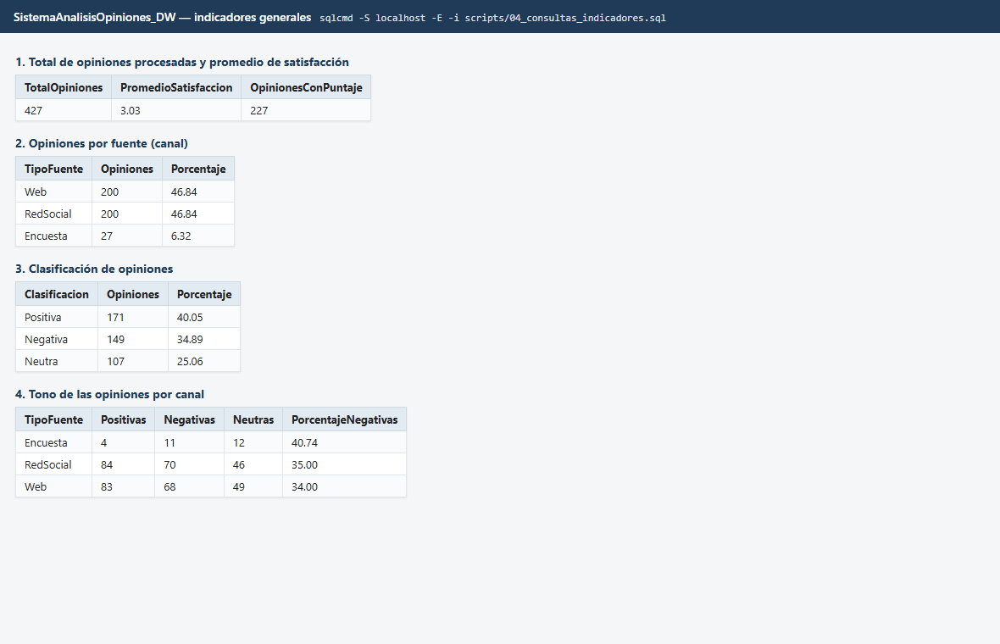
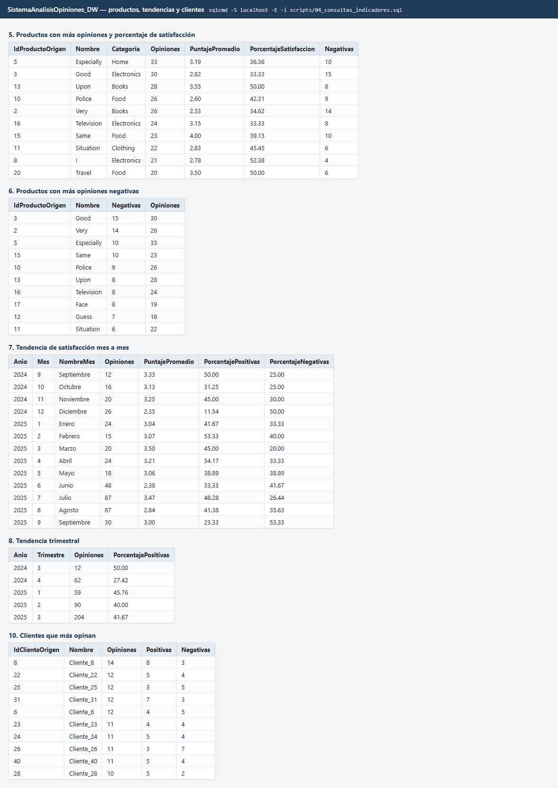
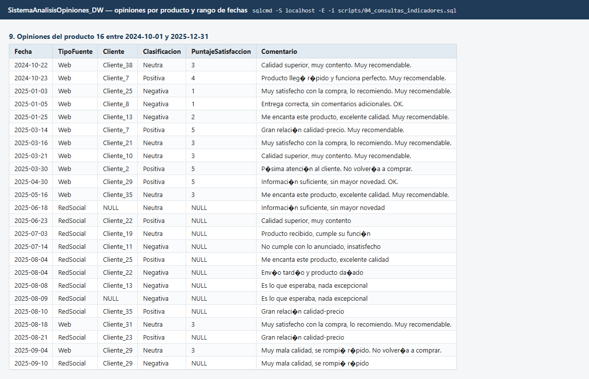
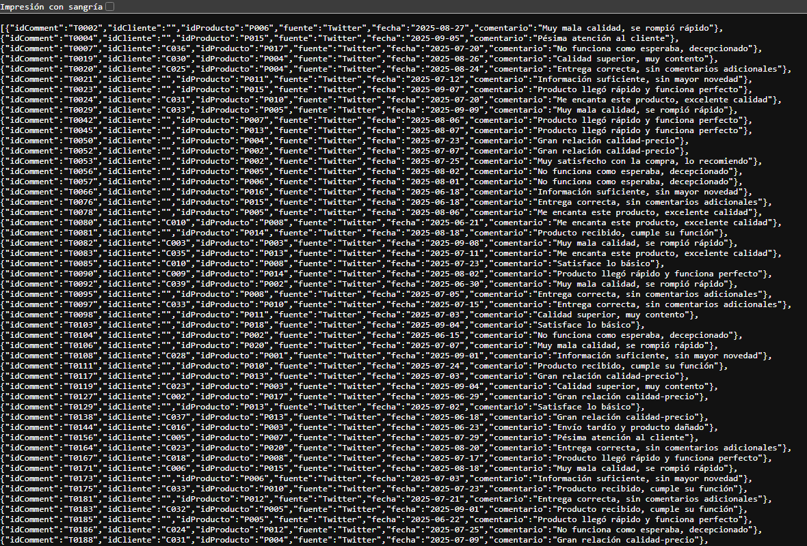

# Sistema de Análisis de Opiniones de Clientes — Proceso ETL

Worker Service en **.NET 8** que consolida las opiniones que una tienda en línea recibe por tres canales distintos, las valida, las clasifica y las carga en un Data Warehouse con modelo estrella, más un **dashboard en ASP.NET Core + Chart.js** que muestra los indicadores de satisfacción y las tendencias de opinión.

| Fuente | Tecnología de extracción | Datos |
|---|---|---|
| Archivos CSV | CsvHelper | Encuestas internas y catálogos (clientes, productos, fuentes) |
| Base de datos relacional (`TiendaWebOrigen`) | ADO.NET (`Microsoft.Data.SqlClient`) | Reseñas del sitio web |
| API REST (`TiendaSocialApi`) | `IHttpClientFactory` | Comentarios de redes sociales |



## Qué hace el proceso

1. **Extracción en paralelo.** Los tres extractores (`CsvExtractor`, `DatabaseExtractor`, `ApiExtractor`) implementan `IExtractor` y corren a la vez con `Task.WhenAll`. Una fuente caída se registra y no detiene a las demás.
2. **Validación y carga al staging** (`SistemaAnalisisOpiniones`). Cada fila se valida (campos obligatorios, longitudes, fechas, rangos 1-5), se normalizan los identificadores de origen (`C007` → `7`, `P016` → `16`), se descartan duplicados contra el archivo y contra la base, y se exige integridad referencial con clientes y productos. Los rechazos se reportan con fila, clave y motivo, y se exportan a `etl_rejected_log.csv`.
3. **Carga de dimensiones** (`SistemaAnalisisOpiniones_DW`). `Dim_Cliente`, `Dim_Producto`, `Dim_Fecha`, `Dim_Fuente` y `Dim_Sentimiento` se cargan de forma incremental e idempotente: el proceso puede repetirse sin duplicar registros.
4. **Transformación y carga de hechos.** `Fact_Opinion` se limpia y se repuebla desde las tres tablas de staging resolviendo las claves sustitutas. La clasificación de sentimiento se obtiene de la fuente cuando existe (encuestas), se deriva del rating en las reseñas web (4-5 positiva, 3 neutra, 1-2 negativa) y se calcula **por palabras clave** en los comentarios sociales, que no traen puntaje.
5. **Resumen en consola** de cada fase: registros y duración por fuente, insertados y rechazados por tabla, y distribución de sentimientos por fuente.
6. **Dashboard interactivo** (`SistemaAnalisisOpiniones.Dashboard`) que consulta el Data Warehouse y muestra los KPI y las gráficas.


### Clasificador de sentimiento

`SentimentClassifier` implementa el enfoque sencillo que pide el SRS: un léxico en español de términos positivos y negativos con peso, frases de varias palabras que se evalúan primero ("relación calidad-precio", "no volvería a comprar", "sin mayor novedad") e inversión de polaridad cuando el término viene precedido por una negación ("no lo recomiendo"). Ignora acentos y mayúsculas. El signo del puntaje total decide entre Positiva, Negativa y Neutra.

### Dashboard

Minimal API en ASP.NET Core que expone los indicadores del DW como JSON (`/api/resumen`, `/api/sentimientos`, `/api/fuentes`, `/api/tendencia`, `/api/productos`, `/api/productos/{id}/tendencia`, `/api/productos/{id}/opiniones`) y una página estática con Chart.js que los dibuja:

- KPI: opiniones procesadas, satisfacción promedio, porcentaje de positivas y negativas, productos y clientes con opiniones.
- Clasificación de opiniones (dona) y opiniones por canal apiladas por tono.
- Tendencia mensual del porcentaje de positivas y negativas, del puntaje promedio y del volumen.
- Productos con más opiniones y su porcentaje de satisfacción.
- Filtro por producto y rango de fechas con la tendencia del producto y la lista de opiniones.

## Capturas

| Dashboard: indicadores y clasificación | Dashboard: producto y rango de fechas |
|---|---|
|  |  |

| Extracción y carga al staging | Dimensiones y Fact_Opinion |
|---|---|
|  |  |

| Indicadores generales | Productos, tendencias y clientes |
|---|---|
|  |  |

| Opiniones por producto y rango de fechas | API de comentarios sociales |
|---|---|
|  |  |

El diagrama de flujo completo del proceso está en [`docs/diagramas/flujo.png`](docs/diagramas/flujo.png).

## Estructura de la solución

```
├── SistemaAnalisisOpiniones/          Worker Service ETL
│   ├── Domain/                        DTOs de las fuentes y modelos de resultado
│   ├── Application/                   IExtractor, ISentimentClassifier, EtlRunner, DwRunner, FactRunner, ReportPrinter
│   ├── Infrastructure/                Extractores, loaders de staging, loaders del DW, validación
│   ├── Configuration/                 Opciones tipadas (Etl, Dw, Fuentes)
│   └── Data/Csv/                      Encuestas y catálogos de origen
├── SistemaAnalisisOpiniones.Tests/    Pruebas xUnit del clasificador y de la validación
├── SistemaAnalisisOpiniones.Dashboard/ Dashboard ASP.NET Core + Chart.js sobre el Data Warehouse (puerto 5190)
├── TiendaSocialApi/                   Minimal API que expone los comentarios sociales (puerto 5180)
├── scripts/                           Creación de las bases, siembra y consultas de indicadores
└── docs/                              Diagramas y capturas
```

## Modelo estrella

```
Dim_Fecha ───┐
Dim_Cliente ─┤
Dim_Producto ┼── Fact_Opinion (PuntajeSatisfaccion, Comentario, OrigenTipo, OrigenId)
Dim_Fuente ──┤
Dim_Sentimiento ┘
```

`scripts/03_crear_datawarehouse.sql` crea las tablas con sus claves foráneas, restricciones de dominio e índices sobre cada clave de la tabla de hechos.

## Requisitos

- SDK de .NET 8
- SQL Server con autenticación integrada de Windows y `sqlcmd`

## Ejecución

```bash
# 1. Crear el staging, la BD origen (con su siembra) y el Data Warehouse (una sola vez)
sqlcmd -S localhost -E -i scripts/00_crear_staging.sql
sqlcmd -S localhost -E -i scripts/01_crear_tiendaweborigen.sql
sqlcmd -S localhost -E -f 65001 -i scripts/02_sembrar_resenas.sql
sqlcmd -S localhost -E -i scripts/03_crear_datawarehouse.sql

# 2. Levantar la API de comentarios sociales
dotnet run --project TiendaSocialApi

# 3. En otra terminal, ejecutar el Worker ETL
dotnet run --project SistemaAnalisisOpiniones

# 4. Consultar los indicadores del Data Warehouse
sqlcmd -S localhost -E -i scripts/04_consultas_indicadores.sql

# 5. Abrir el dashboard en http://localhost:5190
dotnet run --project SistemaAnalisisOpiniones.Dashboard

# Pruebas
dotnet test
```

El Worker termina solo al finalizar el proceso. Si tu instancia no es la predeterminada, sobreescribe las cadenas de conexión con variables de entorno o User Secrets:

```bash
set Etl__ConnectionString=Server=localhost\MSSQLSERVER01;Database=SistemaAnalisisOpiniones;Trusted_Connection=True;TrustServerCertificate=True;
set Dw__ConnectionString=Server=localhost\MSSQLSERVER01;Database=SistemaAnalisisOpiniones_DW;Trusted_Connection=True;TrustServerCertificate=True;
set Fuentes__BaseDatos__ConnectionString=Server=localhost\MSSQLSERVER01;Database=TiendaWebOrigen;Trusted_Connection=True;TrustServerCertificate=True;
```

El dashboard lee `Dw:ConnectionString` de su propio `appsettings.json` y acepta la misma variable `Dw__ConnectionString`.

### Datos de origen

Los archivos de `Data/Csv` y `scripts/web_reviews.csv` son los entregados en el curso. Las encuestas hacen referencia a clientes que no existen en el catálogo, por lo que el proceso rechaza 473 de las 500 por integridad referencial y lo deja documentado en el resumen y en `etl_rejected_log.csv`. Es el comportamiento esperado: el staging nunca acepta una opinión sin cliente ni producto válidos.

## Indicadores disponibles

`scripts/04_consultas_indicadores.sql` responde las preguntas planteadas para el modelo analítico:

- Total de opiniones procesadas y promedio de satisfacción general.
- Opiniones por fuente y porcentaje de cada canal.
- Clasificación de opiniones (positivas, negativas, neutras) con su porcentaje.
- Tono por canal: qué canal concentra más comentarios negativos.
- Productos con más opiniones, puntaje promedio y porcentaje de satisfacción.
- Productos con más opiniones negativas.
- Tendencia de satisfacción mensual y trimestral.
- Opiniones de un producto en un rango de fechas.
- Clientes que más opinan.

## Configuración

Las fuentes viven en la sección `Fuentes` de `SistemaAnalisisOpiniones/appsettings.json`. Cada una puede deshabilitarse con `"Enabled": false` sin tocar código, y la carga del Data Warehouse se apaga con `"Dw:Enabled": false`. No hay credenciales en el repositorio: las cadenas usan autenticación integrada y pueden sobreescribirse con User Secrets (`dotnet user-secrets set "Etl:ConnectionString" "..." --project SistemaAnalisisOpiniones`).

## Atributos de calidad

- **Rendimiento:** E/S asíncrona de extremo a extremo, extracción paralela y métricas con `Stopwatch` en cada fase.
- **Escalabilidad:** agregar una fuente es una clase que herede de `ExtractorBase`, una subsección de configuración y un registro en el contenedor.
- **Seguridad:** consultas parametrizadas, sin credenciales en el código, `IHttpClientFactory` con timeout.
- **Mantenibilidad:** capas Domain / Application / Infrastructure, plantillas `ExtractorBase`, `StagingLoaderBase<TDto>` y `DimensionLoaderBase`, `ILogger` en todos los componentes.

## Documentación

Los diagramas de arquitectura y de flujo están en `docs/diagramas/` (con su fuente Mermaid en `*.mmd`) y las capturas de una corrida real en `docs/capturas/`. El documento técnico con la justificación de la arquitectura y los informes de carga se entregan por separado.

## Contexto

Proyecto de la materia Big Data (ITLA, 2026).
