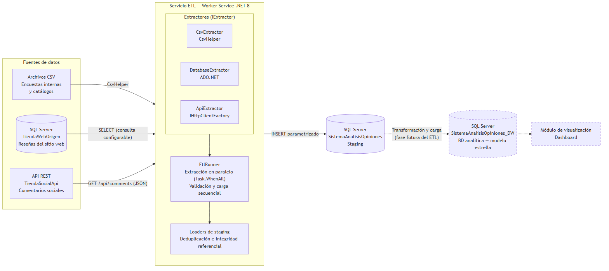
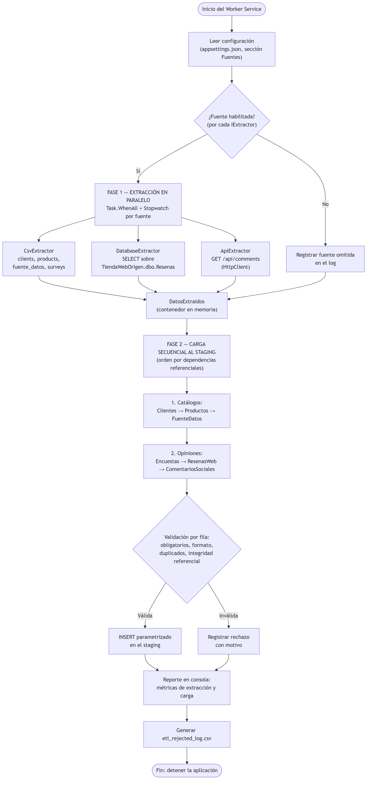

{width="5.18in"}

**Presentación**

**Nombres:** Mario Alejandro

**Apellidos:** Sabala Encarnación

**Matrícula:** 2025-1035

**Carrera:** Desarrollo de Software

**Materia:** Big Data

**Tema:** Creación de la Arquitectura y Desarrollo del Proceso de Extracción (E de ETL)

**Docente:** Francis Ramírez

**Fecha de entrega:** 05/08/2026

**Repositorio de GitHub:** https://github.com/MarioMahir/-SistemaAnalisisOpiniones

```{=openxml}
<w:p><w:r><w:br w:type="page"/></w:r></w:p>
```

## 1. Introducción

Este documento describe la arquitectura y la implementación del proceso de **extracción (E de ETL)** del Sistema de Análisis de Opiniones de Clientes. El sistema consolida opiniones que llegan por tres canales heterogéneos:

- **Archivos CSV** — encuestas internas de satisfacción y catálogos (clientes, productos, fuentes de dato).
- **Base de datos relacional** (`TiendaWebOrigen`) — reseñas publicadas en el sitio web de la tienda.
- **API REST** (`TiendaSocialApi`) — comentarios de redes sociales.

El proceso se implementó como un **Worker Service en .NET 8** que extrae de las tres fuentes **en paralelo**, valida los registros y los guarda en las tablas de *staging* de la base de datos `SistemaAnalisisOpiniones`.

## 2. Diagrama de arquitectura



Componentes principales:

| Componente | Tecnología | Responsabilidad |
|---|---|---|
| `CsvExtractor` | C#, CsvHelper | Lee encuestas y catálogos desde archivos CSV |
| `DatabaseExtractor` | C#, ADO.NET (Microsoft.Data.SqlClient) | Ejecuta la consulta configurada sobre la BD de reseñas |
| `ApiExtractor` | C#, IHttpClientFactory | Consume `GET /api/comments` de la API de comentarios |
| `EtlRunner` | C# | Orquesta la extracción paralela y la carga secuencial |
| Loaders de staging | C#, ADO.NET | Validan, deduplican e insertan en el staging |
| `TiendaSocialApi` | ASP.NET Core Minimal API | Simula la plataforma social que expone los comentarios |
| Base analítica + dashboard | SQL Server / por definir | Fases futuras del proyecto (se muestran punteadas) |

La base analítica (`SistemaAnalisisOpiniones_DW`, modelo estrella ya diseñado en la actividad anterior) y el módulo de visualización se integran en fases posteriores; la arquitectura ya los contempla como destinos de la transformación.

## 3. Diagrama de flujo del proceso



El proceso tiene dos fases claramente separadas:

1. **Extracción (paralela).** El `EtlRunner` consulta la configuración, descarta las fuentes deshabilitadas y lanza todos los extractores habilitados a la vez con `Task.WhenAll`. Cada extractor mide su duración con `Stopwatch` y deposita sus registros en un contenedor compartido en memoria (`DatosExtraidos`); como cada fuente escribe colecciones distintas, el paralelismo no necesita bloqueos.
2. **Carga (secuencial).** Los registros se validan fila a fila y se insertan en el staging respetando las dependencias de integridad referencial: primero los catálogos (Clientes, Productos, FuenteDatos) y luego las opiniones (Encuestas, ResenasWeb, ComentariosSociales). Los registros inválidos se rechazan con su motivo y quedan trazados en `etl_rejected_log.csv`.

## 4. Diseño de la solución

### 4.1 Estructura en capas

El Worker se organiza siguiendo los principios de Clean Architecture, con las dependencias apuntando hacia el dominio:

```
SistemaAnalisisOpiniones/
├── Domain/           DTOs de las fuentes y modelos del proceso (sin dependencias)
├── Application/      Interfaz IExtractor, orquestador EtlRunner, reportes
├── Infrastructure/   Implementaciones concretas: extractores y loaders
├── Configuration/    Opciones tipadas bindeadas desde appsettings.json
└── Worker.cs         BackgroundService que dispara el proceso
```

### 4.2 La abstracción `IExtractor`

Cada fuente implementa la misma interfaz:

```csharp
public interface IExtractor
{
    string NombreFuente { get; }
    bool Habilitado { get; }
    Task<ResultadoExtraccion> ExtraerAsync(DatosExtraidos destino, CancellationToken ct);
}
```

Una clase base (`ExtractorBase`) aporta la plantilla común: medición con `Stopwatch`, captura de excepciones (una fuente caída no interrumpe a las demás) y registro con `ILogger`. Las tres implementaciones (`CsvExtractor`, `DatabaseExtractor`, `ApiExtractor`) solo aportan su lógica específica de acceso a datos.

El `EtlRunner` no conoce ninguna implementación concreta: recibe `IEnumerable<IExtractor>` por inyección de dependencias, por lo que **agregar una fuente nueva no requiere modificarlo** (principio abierto/cerrado).

### 4.3 Fuentes de datos reales

- **BD relacional:** la base `TiendaWebOrigen` (scripts `scripts/01_crear_tiendaweborigen.sql` y `02_sembrar_resenas.sql`) simula el sistema transaccional de la tienda con 200 reseñas. Sus columnas `Fecha` y `Rating` se almacenan como texto deliberadamente: el sistema origen no garantiza datos limpios y la validación es responsabilidad del ETL.
- **API REST:** el proyecto `TiendaSocialApi` (Minimal API en `http://localhost:5180`) carga los comentarios al arrancar y los expone en `GET /api/comments`, con filtro opcional `?fuente=Twitter`. El Worker la consume con `IHttpClientFactory`, con `BaseAddress` y timeout configurables.

## 5. Cumplimiento de los atributos de calidad

### 5.1 Rendimiento

- Toda la E/S es **asíncrona** (`async/await` de extremo a extremo: lectura de archivos, `SqlDataReader`, `HttpClient`).
- Las tres fuentes se extraen **en paralelo** con `Task.WhenAll`; la fase dura lo que la fuente más lenta, no la suma de las tres.
- Cada extractor y cada fase se miden con **`Stopwatch`** y se reportan por `ILogger`. Métricas reales de una corrida completa sobre staging vacío:

| Fuente | Registros | Duración |
|---|---|---|
| CSV (encuestas y catálogos) | 3 100 | 226 ms |
| Base de datos (reseñas web) | 200 | 244 ms |
| API REST (comentarios sociales) | 200 | 86 ms |
| **Fase de extracción (paralela)** | **3 500** | **472 ms** |
| Fase de carga al staging | 2 627 insertados | 911 ms |
| **Proceso ETL total** | | **1 385 ms** |

La fase paralela tomó 472 ms cuando la suma secuencial habría sido 556 ms; con fuentes remotas de mayor latencia la ganancia crece proporcionalmente.

### 5.2 Escalabilidad

- La sección `Fuentes` de `appsettings.json` es **modular**: cada fuente tiene su subsección con `Enabled`, rutas/cadenas de conexión y parámetros propios. Deshabilitar una fuente (`"Enabled": false`) la excluye de la corrida sin tocar código — comprobado en ejecución: el log registra `Fuente deshabilitada por configuración: Base de datos (reseñas web)` y el proceso continúa con las restantes.
- Agregar una fuente nueva = una clase que herede de `ExtractorBase` + una subsección de configuración + un registro en el contenedor de dependencias. Ni el orquestador ni las demás fuentes cambian.

### 5.3 Seguridad

- Las credenciales **no se codifican en el código**: viven en `appsettings.json` y pueden sobreescribirse con **User Secrets** en desarrollo (`dotnet user-secrets set "Fuentes:BaseDatos:ConnectionString" "..."`) o con variables de entorno en despliegue, gracias al sistema de configuración jerárquico de .NET. En el entorno actual se usa autenticación integrada de Windows (`Trusted_Connection=True`), por lo que ninguna contraseña queda en texto plano.
- Todas las consultas al staging usan **parámetros SQL** (`SqlParameter`), nunca concatenación de texto, eliminando la inyección SQL.
- Las llamadas HTTP se hacen con `IHttpClientFactory` (gestión correcta del pool de conexiones) y timeout configurado.

### 5.4 Mantenibilidad

- **SRP:** cada extractor conoce una sola fuente; cada loader conoce una sola tabla; el orquestador solo coordina.
- **OCP/DIP:** el orquestador depende de la abstracción `IExtractor`, no de implementaciones; todo se conecta por inyección de dependencias del host de .NET.
- **Plantillas reutilizables:** `ExtractorBase` y `StagingLoaderBase<TDto>` concentran el código repetitivo (métricas, manejo de errores, deduplicación, inserción parametrizada); los hijos solo implementan lo específico.
- **Observabilidad:** `ILogger` en todos los componentes, resumen tabular en consola y log CSV de rechazados con fila, clave y motivo.

## 6. Resiliencia comprobada

Se ejecutó el Worker con la API detenida deliberadamente. El `ApiExtractor` capturó el fallo, lo registró (`Extracción API REST (comentarios sociales): falló ... el equipo de destino denegó expresamente dicha conexión`), el resumen lo marcó como `ERROR` con su motivo, y las fuentes CSV y base de datos completaron su extracción y carga con normalidad. Una fuente caída degrada el resultado, no tumba el proceso.

## 7. Evidencia de la ejecución

Resumen real impreso por el Worker al finalizar (staging vacío, las tres fuentes habilitadas):

```
========================================================================
                    RESUMEN DE LA FASE DE EXTRACCIÓN
========================================================================
Fuente                                   Registros    Duración    Estado
------------------------------------------------------------------------
CSV (encuestas y catálogos)                   3100      226 ms        OK
Base de datos (reseñas web)                    200      244 ms        OK
API REST (comentarios sociales)                200       86 ms        OK
========================================================================

========================================================================
                    RESUMEN DE LA CARGA AL STAGING
========================================================================
Tabla                   Procesados  Insertados  Rechazados
------------------------------------------------------------------------
Clientes                       500         500           0
Productos                     2000        2000           0
FuenteDatos                    100         100           0
Encuestas                      500          27         473
ResenasWeb                     200           0         200
ComentariosSociales            200           0         200
------------------------------------------------------------------------
TOTAL                         3500        2627         873
========================================================================
```

**Nota sobre los rechazos:** los datos de ejemplo tienen una inconsistencia conocida entre fuentes — los catálogos usan IDs numéricos (`1`, `2`, …) mientras que las reseñas y comentarios referencian IDs con prefijo (`C007`, `P016`). El ETL detecta correctamente esa falta de integridad referencial y rechaza los registros con su motivo en lugar de insertar datos huérfanos, que es exactamente el comportamiento deseado de una fase de validación. Unificar el esquema de IDs de los archivos fuente resolvería los rechazos sin cambiar el código.

## 8. Ejecución del proyecto

El código fuente completo está disponible en el repositorio de GitHub: https://github.com/MarioMahir/-SistemaAnalisisOpiniones

```bash
# 1. Crear y sembrar la base de datos origen (una sola vez)
sqlcmd -S localhost -E -i scripts/01_crear_tiendaweborigen.sql
sqlcmd -S localhost -E -f 65001 -i scripts/02_sembrar_resenas.sql

# 2. Levantar la API de comentarios sociales
dotnet run --project TiendaSocialApi

# 3. En otra terminal, ejecutar el Worker ETL
dotnet run --project SistemaAnalisisOpiniones
```

## 9. Conclusiones

La arquitectura entrega un proceso de extracción que cumple los cuatro atributos de calidad exigidos con evidencia medible: extracción paralela asíncrona con métricas reales (rendimiento), fuentes conmutables por configuración y extensibles vía `IExtractor` (escalabilidad), credenciales fuera del código y SQL parametrizado (seguridad), y separación estricta de responsabilidades por capas con abstracciones e inyección de dependencias (mantenibilidad). Sobre esta base, las siguientes fases del proyecto (transformación hacia el modelo estrella y visualización) se integran sin modificar lo construido.
